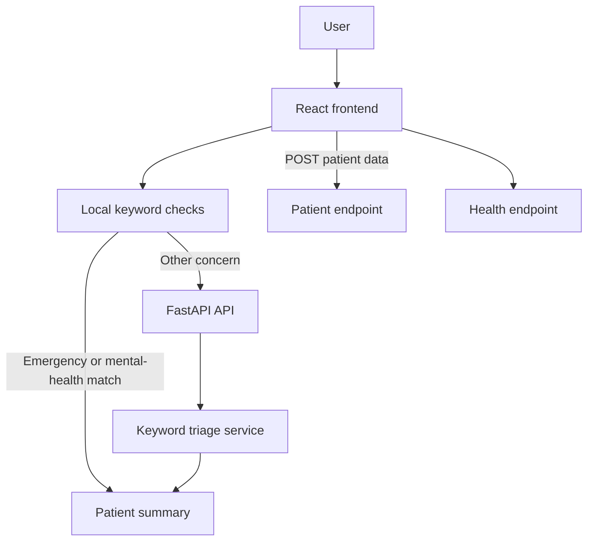

# 🏥 Hospital Receptionist AI

An AI-powered virtual hospital receptionist designed to automate patient interactions, streamline hospital front-desk operations, and provide intelligent healthcare assistance using Large Language Models (LLMs).

---

## 🚀 Live Demo

🔗 https://hospital-reciptionist-ai.vercel.app/

---

## 📌 Features

- 🤖 AI-powered patient interaction system
- 🩺 Symptom-based patient triage assistance
- 📅 Appointment and hospital guidance support
- 🎙️ Voice-enabled interaction support
- 🌙 Modern responsive UI with dark/light mode
- ⚡ Real-time conversational experience
- 🔐 Secure backend architecture
- 🧠 LLM-powered intelligent responses
- 📱 Fully responsive frontend design

---

## 🧠 AI & LLM Integration

This project leverages Large Language Models (LLMs) to provide intelligent healthcare assistance.

### Technologies Used

- Claude API (Anthropic)
- LangGraph workflow orchestration
- Conversational AI pipelines
- Prompt engineering

---

## 🛠️ Tech Stack

### Frontend
- React.js
- Vite
- Tailwind CSS
- JavaScript

### Backend
- FastAPI
- Python
- LangGraph

### Database & Services
- Supabase

### AI/LLM
- Anthropic Claude API

---

## 🏗️ Project Structure

```bash
Hospital_Reciptionist.AI/
│
├── frontend/
├── backend/
├── components/
├── public/
├── app/
└── README.md
```

---
# Hospital Receptionist AI

An AI-oriented hospital reception interface that collects a patient's name, age, and concern, classifies the concern into a hospital ward, and presents a patient intake summary through a React and FastAPI application.

> This is a student project for healthcare information and triage-support workflows. It is not a diagnostic system, emergency service, or replacement for a qualified medical professional.


## Overview

Hospital Receptionist AI demonstrates a full-stack workflow for an AI-assisted hospital reception experience. The frontend provides a dashboard, intake conversation, patient summary, analytics view, and browser-based speech input. The FastAPI backend exposes health, chat-triage, and patient-submission routes.

The current request path uses deterministic keyword matching for ward classification. Emergency and mental-health terms are checked locally in the browser and on the backend; other requests are sent to the backend triage endpoint. The repository also contains Anthropic, LangGraph, and Supabase dependencies/configuration for experimentation, but those services are not currently connected to the active API request path.

## Features

| Feature | Current implementation |
| --- | --- |
| Patient intake | Collects patient name, age, and a free-text concern in the dashboard/chat experience. |
| Ward classification | Assigns `Emergency Ward`, `Mental Health Ward`, or `General Ward` using configured keyword lists. |
| Severity score | The backend calculates a bounded score from 1 to 10 based on emergency and mental-health keywords. |
| Intake summary | Displays the submitted details, ward, and generated triage token in a patient card. |
| Browser voice input | Uses `webkitSpeechRecognition` with the `en-IN` locale to place dictated text into the input field. |
| Responsive interface | React views use Tailwind CSS and include dashboard, chat, analytics, and about screens. |
| Backend health checks | Provides root and health endpoints for basic service status. |
| Vercel configuration | Includes a Vite build configuration with `dist` as the output directory. |

## Architecture



### Request flow

1. The user enters intake information in the React dashboard or chat view.
2. The frontend checks emergency and mental-health keyword lists.
3. When a backend classification is needed, the frontend sends `symptoms` to `POST /api/chat/`.
4. The backend calculates the ward, severity, and a short UUID-based token.
5. The frontend renders a patient intake summary.

The backend uses FastAPI and Pydantic request validation. CORS is configured for the local Vite origins `http://localhost:5173` and `http://127.0.0.1:5173`, and an exception handler returns a generic JSON error for unhandled failures.

## Technology Stack

| Layer | Technologies |
| --- | --- |
| Frontend | React 18, React Router, Vite, Tailwind CSS, Framer Motion, Recharts, Lucide React |
| Backend | Python, FastAPI, Pydantic, Uvicorn, python-dotenv |
| Triage logic | Python keyword matching and severity scoring |
| Optional/configured AI dependencies | Anthropic SDK ecosystem, LangChain Anthropic, LangGraph |
| Optional/configured service dependency | Supabase Python client |
| Deployment configuration | Vercel project configuration for the frontend build |

## Project Structure

```text
Hospital_Reciptionist.AI/
├── backend/
│   ├── main.py
│   ├── requirements.txt
│   ├── routers/
│   │   ├── chat.py
│   │   └── submit.py
│   └── services/
│       ├── claude_service.py
│       └── triage_service.py
├── frontend/
│   ├── index.html
│   ├── package.json
│   ├── vite.config.js
│   └── src/
│       ├── api/hospitalApi.js
│       ├── App.jsx
│       ├── main.jsx
│       └── components/
│           ├── Dashboard.jsx
│           ├── ChatPage.jsx
│           ├── AnalyticsPage.jsx
│           ├── PatientCard.jsx
│           ├── VoiceButton.jsx
│           └── ...
├── supabase_setup.sql
├── vercel.json
├── .gitignore
└── README.md
```

## Frontend

The frontend is a Vite-powered React single-page application. Routes are defined in `src/App.jsx`:

| Route | View |
| --- | --- |
| `/` | Dashboard and patient intake |
| `/chat` | Conversational triage interface |
| `/analytics` | Static ward and activity analytics view |
| `/about` | Project information |

API requests are centralized in `src/api/hospitalApi.js`. The API base URL uses `VITE_API_URL` when provided and otherwise defaults to `http://localhost:8000/api`. The Vite development server proxies `/api` to the local FastAPI server.

The voice button relies on the browser's `webkitSpeechRecognition` API. It does not provide a server-side speech-to-text or text-to-speech pipeline.

## Backend

The FastAPI application is defined in `backend/main.py` and loads environment variables with `python-dotenv`. It requires the three variables listed below at startup. The backend includes request logging, CORS middleware, a lifespan handler, and a global exception handler.

### API endpoints

| Method | Endpoint | Request | Response purpose |
| --- | --- | --- | --- |
| `GET` | `/` | None | Returns application name, version, and running status. |
| `GET` | `/health` | None | Returns a basic healthy status. |
| `POST` | `/api/chat/` | `{ "symptoms": "..." }` | Returns `ward`, `severity`, `token`, and a routing message. |
| `POST` | `/api/patient/` | JSON object | Logs the submitted object and returns a success message. |

FastAPI also exposes interactive documentation at `http://localhost:8000/docs` while the backend is running.

Example triage request:

```bash
curl -X POST http://localhost:8000/api/chat/ \
	-H "Content-Type: application/json" \
	-d '{"symptoms":"The patient has chest pain"}'
```

The response contains a ward classification, a severity score, a generated token, and a human-readable message. The keyword classifier is an application heuristic and should not be interpreted as medical advice.

## AI and Service Integrations

### Anthropic and LangGraph

`backend/services/claude_service.py` defines an Anthropic client and a system prompt for a hospital receptionist assistant using the `claude-3-5-haiku-latest` model. LangChain Anthropic and LangGraph are listed in `backend/requirements.txt`.

At the current repository state, the active FastAPI routes import and use `services.triage_service`, not `claude_service.py` or a LangGraph graph. Therefore this README does not present Claude or LangGraph as part of the running triage request path.

### Supabase

The repository includes `supabase_setup.sql`, which defines a `patients` table with an insert policy and an optional anonymous read policy. The backend validates `SUPABASE_URL` and `SUPABASE_KEY` at startup, but the current patient route does not create a Supabase client or persist records to that table. The SQL policies should be reviewed and restricted before any real deployment.

## Installation

### Prerequisites

- Node.js and npm
- Python 3.x
- The environment variables required by the backend

Clone the repository:

```bash
git clone https://github.com/Mateenjr7/Hospital_Reciptionist.AI.git
cd Hospital_Reciptionist.AI
```

### Backend setup

```bash
cd backend
python -m venv .venv
```

Windows PowerShell:

```powershell
.venv\Scripts\Activate.ps1
pip install -r requirements.txt
uvicorn main:app --reload
```

The backend starts at `http://localhost:8000`.

### Frontend setup

In a second terminal:

```bash
cd frontend
npm install
npm run dev
```

The frontend starts at `http://localhost:5173`.

## Environment Variables

Create `backend/.env` with values for the variables the backend validates:

| Variable | Purpose |
| --- | --- |
| `ANTHROPIC_API_KEY` | Anthropic credential used by the configured Claude service module. |
| `SUPABASE_URL` | Supabase project URL required by backend startup validation. |
| `SUPABASE_KEY` | Supabase key required by backend startup validation. |
| `VITE_API_URL` | Optional frontend API base URL; defaults to `http://localhost:8000/api`. |

Never commit real credentials. `backend/.env` and `.env` are ignored by Git.

## Deployment

The root `vercel.json` configures a Vite build with `npm run build` and `frontend/dist` as the output directory. The frontend package scripts and Vercel configuration should be kept aligned when deploying.

No backend hosting configuration is included in the repository. A deployed frontend will need a separately hosted FastAPI service and a matching `VITE_API_URL`; the checked-in Vite development proxy only targets a local backend.

## Healthcare Safety and Scope

This project is intended to demonstrate conversational intake and basic routing support. It should only be used with appropriate oversight and non-sensitive test data. It does not diagnose conditions, replace clinicians, provide emergency response, or establish a clinical recommendation. For a real healthcare deployment, the system would require rigorous evaluation, privacy controls, access control, auditability, and review by qualified healthcare and security professionals.

## Limitations

- Ward classification is based on fixed keyword lists and can miss context, spelling variations, or nuanced symptoms.
- The current backend triage route does not call Claude, LangGraph, or Supabase.
- The patient endpoint acknowledges a submission but does not persist it to the supplied Supabase schema.
- The voice feature depends on browser support for `webkitSpeechRecognition` and is configured for `en-IN`.
- The analytics screen contains frontend-defined sample values rather than a live analytics API.
- The application has no authentication, hospital-specific knowledge base, or EHR integration.
- External API credentials are required because the backend validates them at startup.

## Future Improvements

- Connect the patient route to Supabase with restrictive row-level security policies.
- Replace heuristic triage with an evaluated, guarded workflow and clear escalation behavior.
- Integrate and test the Claude service through an explicit backend route or LangGraph workflow.
- Add authentication, role-based access, audit logs, and privacy-preserving data handling.
- Add hospital-specific retrieval, multilingual support, and a production speech pipeline.
- Replace static analytics with persisted, permissioned operational metrics.
- Add automated backend tests, frontend tests, integration tests, and model-safety evaluations.

## Academic and Technical Significance

This project demonstrates a practical full-stack AI application surface: a React conversational interface, a FastAPI service boundary, deterministic triage logic, API contracts, browser speech input, and configuration for future LLM and backend-service integration. It also provides a useful starting point for studying responsible healthcare UX, workflow evaluation, and the difference between an AI-enabled interface and a clinically validated system.

## Contributing

Issues and pull requests are welcome. Please keep changes focused, avoid committing secrets or patient data, and include verification steps for backend, frontend, or integration changes.

## License

No license file is currently included in the repository. Add an explicit license before redistributing the project.

## Author

**Abdul Mateen**

- GitHub: [Mateenjr7](https://github.com/Mateenjr7)
- LinkedIn: [Mohammed Mateen Jr.](https://www.linkedin.com/in/mohammed-mateen-jr/)
